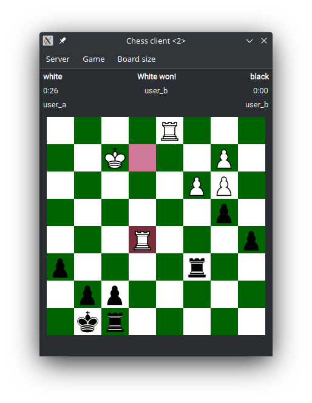

# Client-server chess application
[_in Hungarian_](./README.md)

# Description
The task is to create a chess application with a client-server architecture under Linux.

The functionalities of the server:
- store registered users
- handle multiple concurrent games
- store game states, and validate the moves
- search for random opponent

functionalities of the client:
- connect to, and communicate with the server over TCP connection
- display the game, and UI

# Dependencies
GNU make, g++, qmake (qt5-qmake, qmake-qt5), Qt5 library (with headers)

# Run
To compile the project run the **make** command at the root directory of the project. The **server/bin/server** executable runs the server application. It needs a write permission on the current working directory. The client application is located at **client/bin/client**.

When starting the server the port number can be optionally provided (by default it is 25000):
```
cd server/bin
./server [port]
```

The client executable is located at **client/bin/client**.
The client can be compiled separately by executing the following at the `client/bin` folder:
```
qmake ../client.pro
make
```

## Sample run

We start the server on localhost on port 54242:
```
$ lsof -iTCP -sTCP:LISTEN
COMMAND     PID USER   FD   TYPE DEVICE SIZE/OFF NODE NAME
server    14464 rego    3u  IPv4 351126      0t0  TCP *:54242 (LISTEN)
```

After logging in (left) and entering the queue with the clients, they get matched up (right):

<p align="center">
     
     &nbsp; &nbsp; &nbsp; &nbsp;
     
</p>

First move (left), and the opening (Ruy-Lopez Morphy defence) are shown (right):

<p align="center">
   
   &nbsp; &nbsp; &nbsp; &nbsp;
   
</p>

The possible moves are shown in amber when choosing a piece:

<p align="center">
  
   &nbsp; &nbsp; &nbsp; &nbsp;
  
</p>

End of game, black loses, although being up in material:

<p align="center">
  
&nbsp; &nbsp; &nbsp; &nbsp;
  
</p>


## The network protocol
The messages: (all of them end in '\n')
| Sender | Content | Description |
|:-----:|:---:|:---:|
|client| REGISTER \<name\> \<password\> | register a new user |
|client| LOGIN \<name\> \<password\> | login as a user |
|client| START | start a new game against a random opponent |
|client| MOVE \<x\> \<y\> | move with a piece on the board |
|server| OK | the client's message was successful|
|server| ERROR \<error message\> | reply with an error to the client's message |
|server| GAME \<white\> \<black\> \<time_white\> \<time_black\> \<result\> | Game status update, also this reports the end of  a game|
|server| MOVED \<x\> \<y\> | the other player's move |

The server replies with an OK, or an ERROR message on each message of the client. When a game is running, a GAME message is sent periodically, and a MOVED message when the opponent made a legal move.

